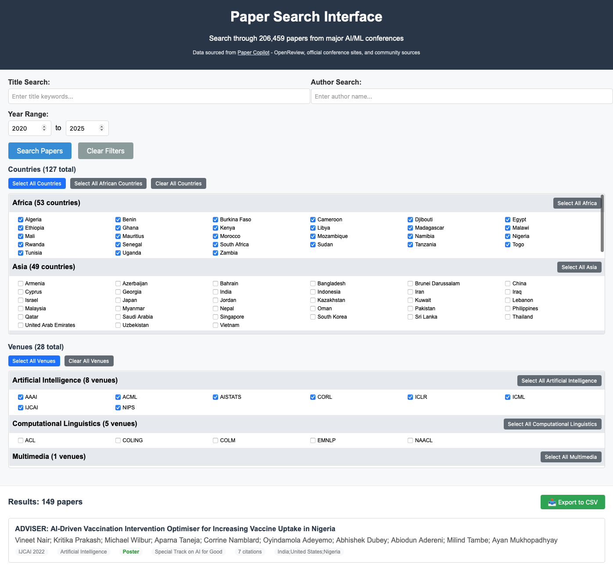

# Paper Search Interface

A web-based tool for searching and analyzing academic papers from major conferences and journals across multiple research subfields. This tool processes paper metadata from [Paper Copilot](https://papercopilot.com) to provide advanced search and filtering capabilities.



## ⚠️ Important Notice

**This repository includes both the search interface and the paper data for immediate use.**

- **Data Source**: All paper metadata originates from [Paper Copilot](https://papercopilot.com)
- **Usage Rights**: Users must comply with Paper Copilot's [Terms and Conditions](https://papercopilot.com/policy/terms-and-conditions/)
- **Data Processing**: This tool processes data for personal, non-commercial use only

## Features

- **Advanced Search**: Search by title, author, conference, year, and more
- **Geographic Filtering**: Filter by countries and continents
- **Venue Organization**: Browse conferences organized by research subfield
- **Status Tracking**: View paper acceptance status with color coding
- **CSV Export**: Export search results to CSV format
- **Bulk Selection**: Select all countries, African countries, or venues with one click

## Supported Research Areas

The tool supports papers from major conferences and journals across these research subfields:

- **Artificial Intelligence**: AAAI, ICML, ICLR, NeurIPS, IJCAI, AISTATS, CORL, ACML
- **Computational Linguistics**: ACL, EMNLP, NAACL, COLING, COLM
- **Computer Vision & Pattern Recognition**: CVPR, ICCV, ECCV, WACV
- **Computer Graphics**: SIGGRAPH, SIGGRAPH Asia
- **Robotics**: ICRA, IROS, RSS
- **Data Mining & Analysis**: KDD
- **Databases & Information Systems**: WWW
- **Multimedia**: ACMMM
- **Computer Networks**: SITCOM
- **And more...**

## Quick Start

### Prerequisites
- Python 3.8 or higher

### Installation

1. **Clone the repository**:
   ```bash
   git clone https://github.com/jonstraveladventures/paper-search-interface.git
   cd paper-search-interface
   ```

2. **Set up the environment**:
   ```bash
   # On Unix/Linux/macOS:
   chmod +x install.sh
   ./install.sh
   
   # On Windows:
   install.bat
   ```

3. **Start the web interface**:
   ```bash
   python run.py
   ```

4. **Open your browser** and go to `http://localhost:5001`

## Usage

### Basic Search
- Enter keywords in the title search box
- Type author names in the author search box
- Use the year range sliders to filter by publication year

### Advanced Filtering
- **Countries**: Select specific countries or entire continents
- **Venues**: Choose conferences organized by research subfield
- **Bulk Selection**: Use buttons to select all countries, African countries, or venues

### Export Results
- Click the "📥 Export to CSV" button to download search results
- The exported file includes all paper metadata

## Data Attribution

This tool includes data from [Paper Copilot](https://papercopilot.com). Please ensure you comply with their [Terms and Conditions](https://papercopilot.com/policy/terms-and-conditions/) when using this tool.

## Project Structure

```
paper-search-interface/
├── tools/
│   ├── web_interface.py          # Flask web application
│   ├── combine_papers.py         # Data processing script
│   ├── find_name_papers.py       # Author search utility
│   └── templates/
│       └── index.html            # Web interface template
├── run.py                        # Application launcher
├── requirements.txt              # Python dependencies
├── install.sh                    # Unix/Linux/macOS setup script
├── install.bat                   # Windows setup script
├── all_papers.csv                # Combined paper data
├── [conference/journal folders]/ # Individual conference and journal data
└── README.md                     # This file
```

## API Endpoints

- `GET /` - Main search interface
- `GET /search` - Search API (returns JSON)
- `GET /export_csv` - Export search results to CSV

## Development

### Local Development Setup
```bash
# Create virtual environment
python -m venv venv
source venv/bin/activate  # On Windows: venv\Scripts\activate

# Install dependencies
pip install -r requirements.txt

# Run in development mode
cd tools && python web_interface.py
```

### Adding New Features
1. Fork the repository
2. Create a feature branch
3. Make your changes
4. Test thoroughly
5. Submit a pull request

## Contributing

We welcome contributions! Please see [CONTRIBUTING.md](CONTRIBUTING.md) for guidelines.

## License

This project is licensed under the MIT License - see the [LICENSE](LICENSE) file for details.

## Acknowledgments

- **Data Source**: [Paper Copilot](https://papercopilot.com) - The original source of all paper metadata
- **Built with**: Flask, Pandas, HTML/CSS/JavaScript
- **This repo was built using Cursor.**

## Disclaimer

This tool is provided for educational and research purposes. Users are responsible for ensuring they have proper rights to use any data processed by this tool. The developers are not responsible for any misuse of data or violation of third-party terms of service.

## Contact

For questions about this tool, please open an issue on GitHub.

For questions about data usage rights, please contact [Paper Copilot](https://papercopilot.com).

